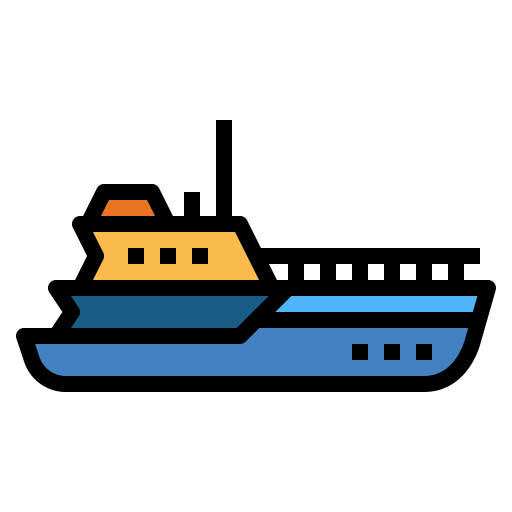

<h1 align="center">
  <br>
  <a href="http://github.com/cakehappens/seaworthy"></a>
  <br>
  Seaworthy
  <br>
</h1>

<h4 align="center">Post-apply check to verify your K8s resources are <i>Seaworthy</i></h4>

<!-- <a href="https://github.com/cakehappens/seaworthy/releases/">
  
</a> -->

<p align="center">
  <a href="https://github.com/cakehappens/seaworthy/actions">
    
  </a>
  <a href="https://pkg.go.dev/github.com/cakehappens/seaworthy">
    
  </a>
  <a href="./go.mod">
    
  </a>
  <br />
  <a href="https://saythanks.io/to/ghostsquad">
    
  </a>
  <a href="buymeacoff.ee/50onA1pjc">
    
  </a>
  <a href="./LICENSE">
    
  </a>
</p>

<p align="center">
  <a href="#introduction">Introduction</a> •
  <a href="#install">Install</a> •
  <a href="#how-to-use">How To Use</a> •
  <a href="#credits">Credits</a> •
  <a href="#related--inspiration">Related</a> •
  <a href="#credits">License</a> •
  <a href="#license">License</a>
</p>

## 👋 Introduction

`Seaworthy` is your post-apply validation that your K8s resources deployed correctly and are healthy.

<p align="center">
  <a href="https://asciinema.org/a/rQiNNFKIL5N5R4E3JUrjVQ6s7">
    
  </a>
</p>

## ⚡️ Install

```shell
go get github.com/cakehappens/seaworthy/cmd/seaworthy
```

### ASDF

_coming soon_

```shell
asdf plugin-add seaworthy https://github.com/cakehappens/asdf-seaworthy.git
```

## 📖 How To Use

```shell
seaworthy --help
```

You can find more information in [the docs 📖](./docs)!

## ⚖️ License

<a href="./LICENSE">
    
</a>
